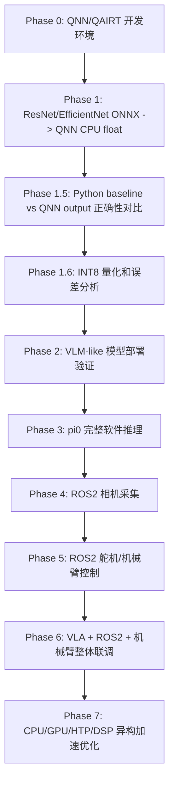

# Qualcomm Intern Notes

这个仓库用于整理 Qualcomm 实习期间的 QNN/QAIRT、VLA/pi0、ROS2 机械臂部署资料。

核心原则：

```text
先跑起来，再跑得快。
先软件闭环，再硬件联调。
先简单模型，再 VLM/pi0。
先 CPU/float 正确性，再 GPU/HTP/量化优化。
```

## 当前主线

目标是在机械臂上部署 pi0 这类 VLA policy。为了降低硬件调试成本，当前采用软件优先路线：



## 第一阶段怎么做

第一次上机建议按这个顺序执行：

1. 配环境
   读 `docs/qnn_development_environment_setup.md`

2. 下载模型、样例图片、跑 Python baseline
   读 `docs/phase1_assets_and_baseline.md`

3. 验证 Python baseline 本身正确
   运行：

```bash
python scripts/phase1/download_resnet_assets.py
python scripts/phase1/run_resnet50_onnx_baseline.py
python scripts/phase1/validate_baseline_pipeline.py
```

4. ONNX -> QNN -> CPU backend 推理
   读 `docs/phase1_qnn_onnx_resnet_runbook.md`

5. 拉回 QNN output 后对比正确性
   运行：

```bash
python scripts/phase1/compare_qnn_with_baseline.py \
  --qnn-output /path/to/qnn_output_dir_or_raw
```

## 阶段计划

### Phase 0：环境配置

交付物：

- 能找到 `QNN_SDK_ROOT` / `QAIRT_SDK_ROOT`
- 能运行 `qnn-onnx-converter --help`
- 能运行 `qnn-model-lib-generator -h`
- 能运行 `qnn-net-run --help`
- Python 3.10 venv 可用
- `envcheck` / `check-python-dependency` 基本通过

参考文档：

- `docs/qnn_development_environment_setup.md`

### Phase 1：QNN 基础闭环

目标：不用机械臂，只把 ResNet/EfficientNet 这类 ONNX 视觉模型转成 QNN，并在 CPU backend 上跑出结果。

交付物：

- ONNX Runtime baseline output
- QNN CPU output
- top-k 对比
- `max_abs_error`
- `mean_abs_error`
- `cosine_similarity`

参考文档：

- `docs/phase1_assets_and_baseline.md`
- `docs/phase1_qnn_onnx_resnet_runbook.md`

### Phase 1.6：量化和 HTP 准备

目标：在 float CPU 正确后，再尝试 INT8 量化、HTP context binary、性能 profiling。

注意：

- HTP/DSP 通常需要量化模型。
- 不要把“转换成功”当成“部署正确”。
- 每次换 backend 都要和 baseline 对比。

参考文档：

- `docs/qnn_backend_inference_modes.md`
- `docs/phase1_qnn_onnx_resnet_runbook.md`

### Phase 2：VLM-like 模型验证

目标：找一个比 pi0 简单的小 VLM / CLIP-like 模型，验证视觉语言模型的 QNN 可部署性。

候选方向：

- CLIP image encoder
- TinyCLIP / MobileCLIP
- SigLIP-small
- 拆分后的 vision encoder + text encoder

交付物：

- VLM candidate table
- ONNX export 结果
- unsupported ops 列表
- embedding cosine similarity 对比

### Phase 3：pi0 软件推理

目标：不碰机械臂，只用离线 observation 跑 pi0/openpi，得到 action。

交付物：

- pi0 输入字段说明
- pi0 输出 action shape/dtype/chunk 长度
- 一次完整 observation -> action 日志
- pi0 模块拆分建议：vision encoder / VLM / action head

### Phase 4：ROS2 相机链路

目标：独立打通相机采集。

交付物：

- image topic 确认
- capture script
- timestamp/frame_id 记录
- 与模型一致的 resize/crop/normalize

### Phase 5：ROS2 控制链路

目标：独立打通舵机或机械臂控制。

交付物：

- 控制接口说明
- 最小安全动作脚本
- safety wrapper
- 急停方式
- 小幅动作测试日志

### Phase 6：整体联调

目标：

```text
camera/state -> observation -> pi0/QNN policy -> action -> safety filter -> robot
```

顺序：

1. dry-run，只打印 action
2. fake controller / RViz
3. 真机小幅空中动作
4. 固定场景最小任务

### Phase 7：异构加速优化

这是后续优化方向，不是当前主线。

可能拆分：

- CPU：ROS2、tokenizer、调度、安全过滤、后处理
- GPU：浮点 vision encoder / VLM
- HTP：量化后的 vision encoder / action head / transformer block
- DSP/LPAI：低功耗或特定子任务

原则：

```text
正确性优先于性能。
模块边界清楚后，再做异构并行。
```

## 文档索引

- `docs/qnn_development_environment_setup.md`
  QNN/QAIRT Linux host、Android/Linux target、Python venv、NDK、envcheck 配置手册。

- `docs/qnn_local_docs_skill.md`
  本地抓取 Qualcomm QNN 文档、建立 SQLite 搜索库、配合 Claude Code / Codex skill 使用的说明。

- `docs/phase1_assets_and_baseline.md`
  ResNet 模型、样例输入、Python ONNX Runtime baseline、baseline 验证流程。

- `docs/phase1_qnn_onnx_resnet_runbook.md`
  ONNX -> QNN `.cpp/.bin` -> model `.so` -> `qnn-net-run` 的照抄手册。

- `docs/qnn_backend_inference_modes.md`
  CPU/GPU/HTP/DSP/HTA/LPAI/Saver backend 区别和运行方式。

- `docs/pi0_vla_ros2_deployment_plan.md`
  更详细的 pi0 VLA + QNN + ROS2 机械臂部署计划。

- `docs/QNN_QAIRT_学习笔记.md`
  QNN/QAIRT 文档中文学习笔记。

- `docs/qnn_outline.tsv`
  QNN 官方文档目录索引。

## 脚本索引

- `scripts/phase1/download_resnet_assets.py`
  下载 ResNet ONNX、测试图片、ImageNet labels。

- `scripts/phase1/run_resnet50_onnx_baseline.py`
  运行 ONNX Runtime baseline，并生成 QNN 可用 `input_0.raw` / `input_list.txt`。

- `scripts/phase1/validate_baseline_pipeline.py`
  验证 Python baseline pipeline 是否自洽和可复现。

- `scripts/phase1/compare_qnn_with_baseline.py`
  对比 QNN `.raw` output 和 ONNX Runtime baseline。

- `scripts/qnn_docs/`
  本地抓取 QNN 文档、建立 SQLite FTS 数据库、检索文档的工具。输出只放在 `artifacts/qnn_docs/`。
  其中 `smart_search_qnn_docs.py` 可把中文/自然语言问题扩展为多组 QNN 英文关键词并合并检索结果。

- `.claude/skills/qnn-local-docs/` 和 `.codex/skills/qnn-local-docs/`
  面向 Claude Code / Codex 的本地 QNN 手册检索 skill，只保存检索流程和原创摘要，不保存原始手册镜像。

## 仓库约定

这个 public 仓库只保存原创笔记、计划、小脚本和轻量索引。

不提交：

- 原始镜像版 Qualcomm 文档页面
- 大模型文件
- 大数据集
- 公司内部路径、账号、IP、日志
- 任何 confidential 资料

大文件默认放在：

```text
artifacts/
```

该目录已加入 `.gitignore`。
