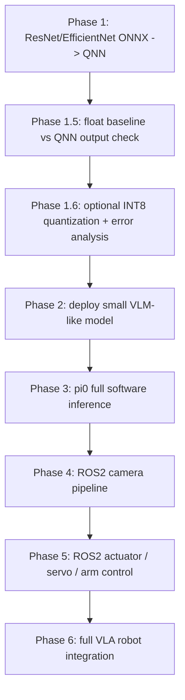

# pi0 VLA + QNN + ROS2 机械臂部署计划

> 目标：最终在机械臂上部署 pi0 这类 VLA policy。
> 当前策略：先软件、后硬件；先简单模型、后 VLM/pi0；先 CPU/浮点闭环、后量化/HTP。
> 计划开始日期：2026-05-26，周二。每天按 8 小时规划。

## 0. 为什么要按这个顺序做

你提出的路线比“一上来就接机械臂”更合理。机械臂、相机、舵机、ROS2 topic、驱动版本、供电、安全限位都会消耗大量调试时间；如果软件部署链路还没跑通，硬件调试时会不知道问题来自模型、QNN、输入预处理、后端、ROS2，还是机械臂本身。

因此主线改成：

1. 先用 ResNet / EfficientNet 这类单输入视觉模型跑通 QNN ONNX 流程。
2. 再用一个和 pi0 中 VLM 部分相似的小 VLM 跑通多输入 / 视觉语言推理。
3. 再做 pi0 完整软件推理，只要求输入 observation 后能得到正确 action。
4. 再分别打通相机采集和舵机/机械臂控制。
5. 最后做 ROS2 + policy + hardware 的整体联调。

这条路线的好处是：前 3 个阶段完全可复用。即使后面换机械臂、换相机、换 ROS2 driver，QNN 转换、模型输入输出校验、误差分析、性能 profiling 的经验仍然有价值。

## 1. 总体路线图

## 2. 阶段定义

### Phase 1：QNN 基础闭环

目标：不用机械臂，只在 Qualcomm 环境中把一个 ONNX 视觉分类模型转成 QNN 可运行形式，并跑出结果。

最小闭环：

- 下载或准备 ResNet/EfficientNet ONNX。
- 准备一张图片，转成模型输入 raw。
- 用 `qnn-onnx-converter` 生成 QNN `.cpp/.bin`。
- 用 `qnn-model-lib-generator` 编译出 `.so` 模型库。
- 用 `qnn-net-run` + `libQnnCpu.so` 跑 CPU backend 浮点推理。
- 用 ONNX Runtime 跑同一输入，比较 top-k、max abs error、cosine similarity。

详细命令见 [phase1_qnn_onnx_resnet_runbook.md](phase1_qnn_onnx_resnet_runbook.md)。

### Phase 1.6：量化和 HTP 准备

目标：在 Phase 1 浮点闭环稳定后，再尝试 INT8 量化和 HTP/DSP backend。

注意：

- QNN 文档明确提醒：HTP/DSP target 必须使用带 `--input_list` 的量化模型。
- 不要把“模型转换成功”当作“部署正确”。要用同一批输入做 baseline vs QNN 的误差分析。
- 优先指标：top-1 是否一致、top-5 是否一致、logits cosine similarity、max abs error、latency。

### Phase 2：部署一个 VLM-like 模型

目标：找一个比 pi0 简单、但结构上相似的小模型，验证视觉语言模型在 QNN/QAIRT 链路中的可行性。

建议模型方向：

- CLIP image encoder + text encoder，先拆开部署。
- MobileCLIP / TinyCLIP / SigLIP-small 这类轻量模型。
- 如果完整 VLM 太大，先只部署 vision encoder，文本部分留在 host。

关键任务：

- 确认多输入模型的 ONNX 导出方式。
- 确认 image input、token input、attention mask 的 dtype/layout。
- 用固定图片和固定 prompt 做 golden output。
- 记录哪些 op 不支持、哪些需要拆图、哪些留在 CPU。

### Phase 3：pi0 完整软件推理

目标：不碰机械臂，纯软件输入 observation，得到 pi0 action，并能解释 action shape 和语义。

最小闭环：

- 准备一份离线 observation：图片、机器人状态、prompt。
- 跑 pi0/openpi 官方推理。
- 记录 action 的 dtype、shape、chunk 长度、控制频率。
- 先不要求 QNN 完整承载 pi0，只要拆清楚哪些模块能上 QNN，哪些模块暂时留 CPU/GPU。

输出：

- `pi0_io_spec.md`：输入输出字段表。
- `pi0_software_inference_log.md`：一次完整推理日志。
- `pi0_partition_plan.md`：vision encoder / VLM / action head 的拆分建议。

### Phase 4：ROS2 相机链路

目标：独立打通相机，不接模型也不控机械臂。

任务：

- `ros2 topic list` 找到 image topic。
- 用 `rqt_image_view` 或脚本确认图像正常。
- 写 image capture node，保存 timestamp、frame_id、RGB 图像。
- 固定 resize / crop / normalize 逻辑，保证和 Phase 1/2 模型输入一致。

### Phase 5：ROS2 控制链路

目标：独立打通舵机/机械臂控制，不接模型也不接相机。

任务：

- 确认控制接口：topic、service、action、MoveIt2、ros2_control 或 vendor SDK。
- 写一个只执行小幅安全动作的脚本。
- 加安全限制：速度、关节角、workspace、timeout、NaN check、急停。
- 记录控制频率、延迟和实际运动方向。

### Phase 6：整体联调

目标：camera/state -> observation -> pi0/QNN policy -> action -> safety filter -> robot。

原则：

- 先 dry-run，只打印 action。
- 再 fake controller/RViz。
- 再真机小幅空中动作。
- 最后才接触物体。

## 3. 每日 8 小时 TODO

### Day 1：周二 2026-05-26，QNN 环境摸底 + Phase 1 准备

上午 4 小时：

- 找到 QNN/QAIRT SDK 安装目录，确认 `QNN_SDK_ROOT`。
- 确认 host 架构目录：通常是 `x86_64-linux-clang`。
- 确认 target 架构目录：可能是 `aarch64-android` 或 Linux aarch64 目录。
- 跑 `qnn-onnx-converter --help`、`qnn-model-lib-generator -h`、`qnn-net-run --help`。

下午 4 小时：

- 下载 ResNet ONNX 或使用 mentor 提供的 ONNX。
- 准备一张测试图片。
- 用 ONNX Runtime 跑出 baseline output。
- 记录模型 input name、shape、dtype、layout。

交付物：

- `qnn_env_check.md`
- `phase1_model_info.md`
- 一份 baseline logits/top-k 结果。

### Day 2：周三，ONNX -> QNN float CPU 闭环

上午 4 小时：

- 用 `qnn-onnx-converter` 转换 ONNX。
- 用 `qnn-model-lib-generator` 生成 host `.so`。
- 在 host 上用 `libQnnCpu.so` 跑 `qnn-net-run`。

下午 4 小时：

- 如果 host 成功，编译 target 架构 `.so`。
- 将 `qnn-net-run`、`libQnnCpu.so`、模型 `.so`、raw input 推到 Qualcomm 设备。
- 在设备 CPU backend 上跑同一张图。
- 拉回 output。

交付物：

- host QNN output。
- target CPU QNN output。
- 运行命令和日志。

### Day 3：周四，误差分析 + 可重复脚本

上午 4 小时：

- 写 baseline vs QNN output 对比脚本。
- 比较 top-1/top-5、max abs error、mean abs error、cosine similarity。
- 检查 layout 是否一致，尤其是 NCHW/NHWC。

下午 4 小时：

- 把 Phase 1 命令整理成可重复脚本。
- 准备 5-20 张 calibration/test 图片。
- 如果 CPU float 稳定，再开始 INT8 量化准备。

交付物：

- `phase1_error_report.md`
- `run_qnn_cpu_float.sh`
- `compare_outputs.py`

### Day 4：周五，INT8 量化试跑

上午 4 小时：

- 准备 `input_list.txt` calibration 数据。
- 用 `qnn-onnx-converter --input_list ... --weights_bitwidth 8 --act_bitwidth 8` 转量化模型。
- 生成量化模型 `.so`。

下午 4 小时：

- 先在 CPU backend 跑量化模型。
- 再视设备条件尝试 HTP backend。
- 分析 float vs int8 的误差。

交付物：

- 量化转换命令。
- INT8 output。
- float vs int8 误差表。

### Day 5：小 VLM 模型调研和拆分

上午 4 小时：

- 找 2-3 个轻量 VLM / CLIP-like 模型。
- 判断是否能导出 ONNX。
- 列出输入：image、input_ids、attention_mask 等。

下午 4 小时：

- 选一个最小模型。
- 先跑 PyTorch/ONNX Runtime baseline。
- 记录每个 tensor 的 shape/dtype。

交付物：

- `vlm_candidate_table.md`
- 选定模型的 baseline 输出。

### Day 6：VLM-like QNN 尝试

上午 4 小时：

- 先转换 vision encoder。
- 如果支持，再转换 text encoder。
- 记录 unsupported ops。

下午 4 小时：

- 运行 QNN CPU backend。
- 比较 image/text embedding cosine similarity。
- 形成拆图建议。

交付物：

- `vlm_qnn_trial.md`
- `unsupported_ops.md`
- embedding 对比结果。

### Day 7：pi0 软件推理

上午 4 小时：

- clone/open pi0 或 openpi 代码。
- 跑官方 demo 或最小 inference。
- 准备离线 observation。

下午 4 小时：

- 记录输入输出 schema。
- 记录 action shape、单位、频率、chunk 策略。
- 初步判断 pi0 哪些部分适合 QNN。

交付物：

- `pi0_io_spec.md`
- `pi0_software_inference_log.md`

### Day 8：ROS2 相机

上午 4 小时：

- 确认 ROS2 版本、相机驱动和 topic。
- 用工具查看图像。
- 写最小 capture script。

下午 4 小时：

- 做图像预处理。
- 保存和 Phase 1/2 一样格式的 raw/numpy 输入。
- 记录 timestamp/frame_id。

交付物：

- `camera_capture_node.py`
- `camera_pipeline.md`

### Day 9：ROS2 机械臂/舵机控制

上午 4 小时：

- 确认控制接口。
- 跑最小安全动作。
- 确认急停。

下午 4 小时：

- 写 safety wrapper。
- 做 dry-run 和小幅真机测试。
- 记录控制延迟和方向。

交付物：

- `safe_motion_node.py`
- `robot_control_interface.md`

### Day 10：整体 dry-run

上午 4 小时：

- observation -> policy -> action 全链路 dry-run。
- action 只打印，不执行。

下午 4 小时：

- 接 fake controller/RViz。
- 如果稳定，再真机小幅空中动作。
- 录日志和 rosbag。

交付物：

- `full_pipeline_dry_run.md`
- latency 表。
- blocker 列表。

## 4. 每天结束前必须记录

每天至少写 5 件事：

1. 今天跑通了什么命令。
2. 今天失败的命令和完整报错。
3. 当前模型输入输出 shape/dtype/layout。
4. 当前 blocker 是模型、工具、权限、设备、ROS2 还是硬件。
5. 明天第一条要执行的命令。

## 5. 第一阶段最重要的判断标准

Phase 1 不以“跑得快”为成功标准，而以“链路可解释、结果可比较、命令可复现”为成功标准。

成功条件：

- 同一张图在 ONNX Runtime 和 QNN CPU backend 上输出接近。
- top-1/top-5 至少能解释。
- 每个输入 tensor 的 raw 文件来源清楚。
- 每个 QNN 工具的输入输出文件路径清楚。
- target 设备上可以独立执行 `qnn-net-run`。

失败也可以接受，但失败必须可定位：

- converter 不支持哪个 op。
- model-lib-generator 编译缺哪个工具链。
- target 上缺哪个 `.so`。
- qnn-net-run 输入列表格式哪里不对。
- output shape/dtype 和 baseline 差在哪里。
